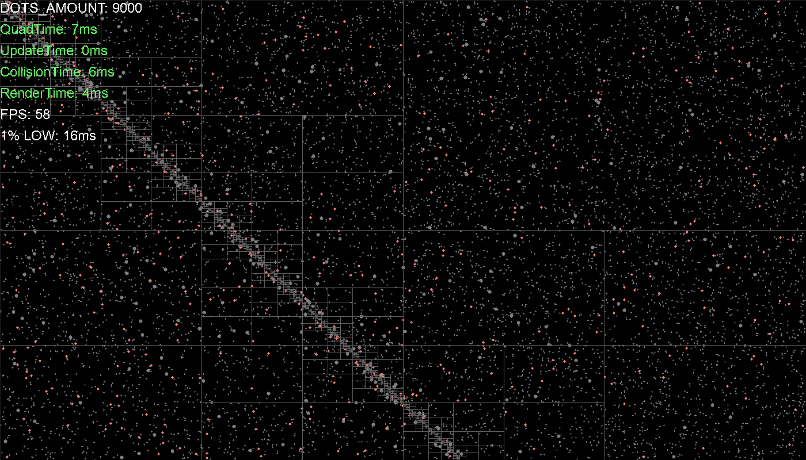

# Wednesday, 6 August 2025
Committed everything. In this time I implemented the following:
- *Changed Build Tool*
    - Went from VSCode to CMake, using the Ninja Build tool. Created a CMakeList.txt and linked the
    libraries together.
- Removed intentional memory leaks. In Game::Update(), there is a part of the code responsible for
deleting "killed" dots, but the code only set the pointer of the Dot to a nullptr, and didn't
actually delete it. Later I will remove the deletion entirely.
- Implemented QuadTree. Nothing to say here, this was pretty simple.

My current tasks are:
- [x] Implement a logging system
- [x] Implement a Debug UI system (could be apart of logging too)

Implemented the logging system and for the UI as well, it's quite nice and handy to easily add new
debug info to the screen.

My next task is as follows:
- [x] Analyze the size of each dot, using less memory == able to have more dots
    - Was able to minimize it to 32 bytes, could do more with bit masking

# Sunday, 17 August 2025
Current Stats:
    [LOG] 1% LOW: 26ms
    [LOG] FPS: 33
    [LOG] RenderTime: 5ms
    [LOG] CollisionTime: 14ms
    [LOG] UpdateTime: 0ms
    [LOG] QuadTime: 6ms
    [LOG] DOTS_AMOUNT: 9000


I reimplemented the QuadTree in a new header file, and it is a lot prettier now and cleaner. Problem is, for some reason went
from 70fps to 35fps, basically halving the performance. I need to look into this.

But for now I'm going to focus on some more fun tasks. 

Next on my list is making the data more cache friendly. Cache-friendly layouts provide the most dramatic improvements. 

## AoS vs SoA:
Structure of Arrays (SoA) over Array of Structures (AoS) can deliver up to 50x faster execution [NumberAnalytics](https://www.numberanalytics.com/blog/ultimate-guide-to-cache-memory-optimization). Storing Arrays of structures leads to worse performance, because say we want to update the position of every dot on the screen. We initially loop through every Dot, and access its position. The CPU, being smart, will load as many dots into the cache as possible, but in the process also load velocity, radius, and other data. This extra data takes up cache space but isn't even being USED! Not to mention, the dots probably have some small bad alignment, meaning there is data in the cache that is completely empty! Here is a text drawn example.

Assuming 72B of cache memory:
```
[ P1, V1, R1, P2, V2, R2, P3, V3, R3 ]
```
                <=>
```
[ P1, P2, P3, P4, P5, P6, P7, P8, P9 ]
```

As you can see, we can fit 3x more positional data into the cache by packing our data with
SoA.

## Loop Unrolling 
Loop unrolling involves transforming a loop by either reducing or removing iterations. Loop
overhead can be attributed to extra CPU instructions and cache misses. For example,

Example 1, simple for loop on array:
```
for(int i = 0; i < 8; i++){
    array[i] = i * 2;
}
```

The overhead for the above code is as follows:
 - 8 counter increments (i++)
 - 8 conditional checks (i < 8)
 - 8 branch instructions (loop body)
 - **Total: 24 control operations**

Example 2, unrolled for loop on array:
```
for(int i = 0; i < 8; i+=4){
    array[i]    = i * 2;
    array[i + 1] = (i + 1) * 2;
    array[i + 2] = (i + 2) * 2;
    array[i + 3] = (i + 3) * 2;
}
```

The overhead for the above code is as follows:
 - 2 counter increments (i += 4)
 - 2 conditional checks (i < 8)
 - 2 branch instructions (loop body)
 - **Total: 6 control operations**

By unrolling this loop, we reduced the overhead by **75.0%**.

It is also worth mentioning, that loop unrolling can be good for cache hits as well. Consider the
following:
```
for(int i = 0; i < 8; i++){
    array[i] = i * 2;               // Cache miss
}
```

When the cache miss hits in this loop, we have to go refill the cache memory. During this time,
the CPU sits idly waiting for the cache to come back.

```
for(int i = 0; i < 8; i+=4){
    array[i]    = i * 2;            // Cache miss
    array[i + 1] = (i + 1) * 2;     // Cache hit
    array[i + 2] = (i + 2) * 2;     // Cache hit
    array[i + 3] = (i + 3) * 2;     // Cache hit
}
```

Here, we got a cache miss on the 2nd line, so we still have to go retrieve new cache memory. But,
there are still 3 operations where we got a cache hit! So while we retrieve the new cache memory, the
CPU has something to do! CPU's often don't run line by line, and in fact when possible will run code
in any order it wants in order to speed up performance. So these other lines will actually be
calculated WHILE the cache is getting retrieved.

So my next tasks are as follows:
- [ ] Change implementation of the Dots. Instead of having a Dot structure, I will have a Dots class
which will store all the data of the dots in seperate arrays. This will surely improve performance.
- [ ] I will look around for any places to do some loop unrolling!

Update:
 - Implemented the SoA, but performance remains the same:
    [LOG] 1% LOW: 28ms          **(+2ms)**
    [LOG] FPS: 33               **(n/a)**
    [LOG] RenderTime: 5ms       **(n/a)**    
    [LOG] CollisionTime: 14ms   **(n/a)**
    [LOG] UpdateTime: 0ms       **(n/a)**
    [LOG] QuadTime: 7ms         **(+1ms)**
    [LOG] DOTS_AMOUNT: 9000     **(n/a)**
    
    I'm curious as to why that is, maybe I need to go deeper. Currently i'm storing the positions and
    velocities as glm::vec2, but for a pure approach it might be better to split it up.

Update:
I did some profiling with a new SimpleProfiler class i created:
    [SimpleProfiler Report]:
        QuadTree query: 22.09ms avg (2650.23ms total, 120 calls)
        filter dead: 0.43ms avg (51.63ms total, 120 calls)
        alive_indices: 0.00ms avg (0.16ms total, 120 calls)
        total: 22.52ms avg (2702.58ms total, 120 calls)
    [LOG] LOGGING KVP DEBUG VALUES:
    [LOG] 1% LOW: 44ms
    [LOG] FPS: 21
    [LOG] RenderTime: 8ms
    [LOG] CollisionTime: 22ms
    [LOG] UpdateTime: 0ms
    [LOG] QuadTime: 12ms
    [LOG] DOTS_AMOUNT: 9000

It seems like mose of the time is taken up by that nasty QuadTree query, an a negligable amount by filtering out the dead ones first. I'm next going to
profile the QuadTree query.

For the query we have the counted stats:

    QuadTree stats: 
    visits=147596 rejects=102962 checks=9848 efficiency=69.8%

    MAX_DOTS=32 MAX_LEVELS=4

Woah, this is really innefficient. We are checking 147k but only actually finding a range we are looking for 70% of the time. Maybe i should try
another approach with a faster lookup time.

Update:
Implemented a Spatial Grid. I'm very impressed. Something to know about Quad Trees is that they perform very well for dynamic objects, where size,
location and velocity all vary. But for uniform objects, distributed evenly with same size and speed, it only creates an overhead. Clocking the new
implementation gives me this:

        [LOG] LOGGING KVP DEBUG VALUES:
        [LOG] 1% LOW: 13ms          **(-31ms / -70.45%)**
        [LOG] FPS: 70               **(+49fps / +333.33%)**
        [LOG] RenderTime: 8ms       **(n/a)**
        [LOG] CollisionTime: 3ms    **(-19ms / -86.36%)**
        [LOG] UpdateTime: 0ms       **(n/a)**
        [LOG] DOTS_AMOUNT: 9000     **(n/a)**

This is really cool. I'm finally back to where i was before, and along the way I could drop that dang QuadTree.

 - [x] Next up is some clean-up. I want to hammer in this profiler I created, and clean up some of my code. It should be pretty simple to get profiling data, such as timings and counts, avg and
screen debug info.
- [ ] Take a look at some optimizations for the renderer. Here is a snapshot of the performance before:
    [LOG] LOGGING KVP DEBUG VALUES:
    [LOG] 1% LOW: 14ms
    [LOG] FPS: 68
    [LOG] render: 8.71ms avg
    [LOG] collisions: 3.31ms avg
    [LOG] dots_update: 0.17ms avg
    [LOG] grid_build: 0.43ms avg
    [LOG] DOTS_AMOUNT: 9000

    For Dots with a radius of 1, you can just draw a point. This reduces the render time down to **5.8ms**, a
    **2.9ms** drop (**0.33%**).  Although "technically" they are supposed to be sized by two (since radius of 1
    means diameter of 2).

    UPDATE: Tried to render everything on different threads, but turns out that SDL can only render on the main
    thread, so that was a failure. I think i'll just draw some hexagons instead since that seems to be easier.
        [LOG] LOGGING KVP DEBUG VALUES:
        [LOG] 1% LOW: 11ms              **(-3ms)**
        [LOG] FPS: 81                   **(+13fps)**
        [LOG] render: 6.54ms avg        **(-2.17ms)**
        [LOG] collisions: 3.16ms avg    **(-0.15ms)**
        [LOG] dots_update: 0.17ms avg   **(n/a)**
        [LOG] grid_build: 0.48ms avg    **(+5ms)**
        [LOG] DOTS_AMOUNT: 9000

    I ended up implementing a pixelBuffer, which the client writes to using the DotRenderer api. I'm a little
    unhappy about that implementation, because it's such a verbose function, but whatevs. I'm thinking, since i'm
    using a pixel buffer now, i could definitely implement a threaded pixel buffer next (since it doesn't actually
    affect the rendering pipeline).

    I'm wondering how many threads i will be able to use. My pc said it could handle 8 threads, but how will i
    balance them between the rendering and collision? It might actually be okay, since the threads would be
    finished and joined before the next process began. But we'll see.


# Monday, 18 August 2025
I have succesfully implemented threaded rendering in the project. The only problem: The rendering
time has gone up. Weirdly, having 8 threads dividing up the tasks should have fixed my problems.
But alas! The process of creating and destroying threads is VERY EXPENSIVE. So my problem rn is
that for every Batch render of dots, I am creating 8 threads and destroying them... EVERY FRAME!

starting_threads:   **6.26 ms avg**
joinging_threads:   **4.35 ms avg**
total:              **10.61 ms avg**
hmmm... so just the process of creating and destroying threads itself takes up 10ms of render
time.

I thought to myself, why don't i just precreate them and then fill them with tasks to do,
destroying them only when the program has finished. Doing some research, this is called:
            
 *Thread Pooling*
The idea is to have a class manage a certain number of threads, and for the main thread to queue
 work onto those threads...

Update: I implemented the thread pool. VERY COOL! It works wonders, just a simple little file
doing all my work, wonderful! I'm so happy.

I was able to get these stats from it:
starting_jobs:      **0.05 ms avg   (-99.20%)!**
waiting_for_jobs:   **4.18 ms avg   (-3.91%)**
total_time:         **4.23 ms avg   (-60.13%)**

Awesome! this is so much better. 4.18ms is just the time it takes to do the jobs, but starting the
jobs is at the best place rn. Somehow i want to fit in the process of bunching together the pixel
arrays into this workflow.

Update: Alright, it has been one hell of a night. I started first by threading the CombineBuffers
function, by splitting up the screens height for each thread, and then the worker thread would
comb through every pixel and check if it was contained in its assigned region. Problem is, combing
through every pixel and skipping a bunch of them is just wasteful. So right before i started the
combine buffer workers, i sorted the pixelData into the threads regions. But this took 6ms and was
way too SLOW!

After a while, I moved the sorting to the drawing pass. Each draw job now also sorts the pixels
into buckets. This gave way to the weirdest vector i've ever seen:

```
std::vector<std::vector<std::vector<Pixel>>> m_threadSortedPixels;
```

Strange huh. With this implementation, i got these results:
    [SimpleProfiler Timers Report]:
        sdl_calls: 1.38ms avg 
        combine_buffers:wait_for_threads: 2.70ms avg 
        combine_buffers:start_threads: 0.06ms avg 
        combine_buffers: 3.21ms avg 
        drawing_buffers:wait_for_threads: 7.27ms avg 
        drawing_buffers:queuing_jobs: 0.08ms avg 
        drawing_buffers: 7.36ms avg 
        total: 11.95ms avg 
    [LOG] LOGGING KVP DEBUG VALUES:
    [LOG] 1% LOW: 14ms
    [LOG] FPS: 47
    [LOG] render: 12.55ms avg     (nice, not where i started... but better now!)
    [LOG] collisions: 8.31ms avg
    [LOG] dots_update: 0.37ms avg
    [LOG] grid_build: 1.05ms avg
    [LOG] DOTS_AMOUNT: 10000


# Cool pics
    Accidentally caused this cool effect while implementing SoA. If you look closely, you can see that
    the QuadTreeNodes contain vast amounts of dots, yet along an axis there is an insane
    distribution of QuadTreeNodes. This happened because I incorrectly mistyped a 'y' to a 'x' like so:

```
if (!bounds.contains(dots.positions_x[index], dots.positions_x[index])) {
    return false;
}
```


